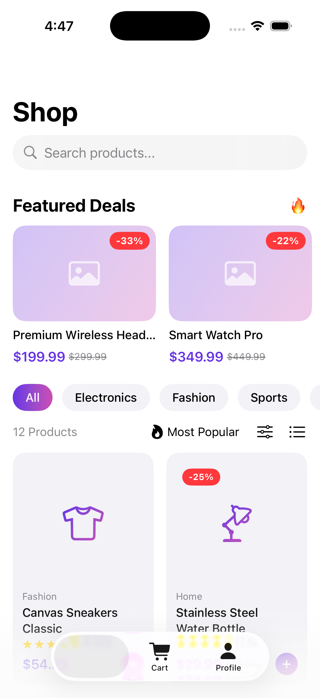

# ShopNow - SwiftUI Ecommerce App

<div align="center">


A complete, production-ready iOS ecommerce application built with SwiftUI featuring product listings, shopping cart, checkout flow, and modern UI/UX.

[Features](#features) • [Installation](#installation) • [Architecture](#architecture) • [Screenshots](#screenshots) • [API](#api-integration)

</div>

---



## ✨ Features

### 🛍️ Product Management
- **Smart Product Listing** - Grid/List view toggle with smooth animations
- **Advanced Filtering** - Category, price range, and availability filters
- **Multi-Sort Options** - Sort by newest, price, rating, or popularity
- **Infinite Scroll** - Pagination with automatic loading
- **Search** - Real-time product search
- **Featured Deals** - Highlighted promotional products

### 🛒 Shopping Cart
- **Real-time Updates** - Live price calculations
- **Quantity Controls** - Increment/decrement with haptic feedback
- **Free Shipping Tracker** - Visual progress indicator
- **Persistent State** - Cart preserved across app sessions
- **Swipe to Delete** - Intuitive item removal

### 💳 Checkout Flow
- **Multi-step Process** - Shipping → Payment → Review
- **Form Validation** - Real-time input validation
- **Multiple Payment Methods** - Credit Card, Apple Pay, PayPal
- **Order Confirmation** - Animated success screen

### 🎨 UI/UX Excellence
- **Custom Gradient Theme** - Beautiful purple/pink gradients
- **Dark Mode Support** - Fully adaptive design
- **Smooth Animations** - Spring animations and transitions
- **Empty States** - Thoughtful placeholders
- **Loading States** - Shimmer effects and spinners
- **Error Handling** - User-friendly error messages

---

## 📱 Screenshots

> **Note**: Add your app screenshots here

---

## 🚀 Installation

### Prerequisites
- macOS 14.0+
- Xcode 15.0+
- iOS 18.0+ (for running on simulator/device)

### Setup

1. **Clone the repository**
```bash
git clone https://github.com/yourusername/shopnow-swiftui.git
cd shopnow-swiftui
```

2. **Open in Xcode**
```bash
open "Ecommerce.xcodeproj"
```

3. **Download iOS Simulator** (if needed)
   - Xcode → Settings → Platforms → iOS → Download

4. **Build and Run**
   - Select your target device/simulator
   - Press `⌘ + R` or click the Run button

---

## 🏗️ Architecture

### MVVM Pattern
```
┌─────────────────────────────────────────┐
│              Views (SwiftUI)            │
│  ProductListView, CartView, etc.        │
└────────────────┬────────────────────────┘
                 │
                 ▼
┌─────────────────────────────────────────┐
│           ViewModels                     │
│  @ObservableObject: CartManager,        │
│  ProductStore                            │
└────────────────┬────────────────────────┘
                 │
                 ▼
┌─────────────────────────────────────────┐
│        Services & Models                 │
│  NetworkManager, Product, Order          │
└─────────────────────────────────────────┘
```

### Project Structure
```
Ecommerce/
├── EcommerceApp.swift          # App entry point
├── ContentView.swift            # Main TabView
├── Models/
│   ├── Product.swift            # Product data model
│   ├── CartItem.swift           # Cart item model
│   ├── Order.swift              # Order & shipping models
│   └── APIResponse.swift        # API response wrappers
├── ViewModels/
│   ├── CartManager.swift        # Cart state management
│   └── ProductStore.swift       # Product fetching & caching
├── Services/
│   └── NetworkManager.swift     # HTTP client (async/await)
├── Views/
│   ├── Products/                # Product listing & detail
│   ├── Cart/                    # Shopping cart views
│   ├── Checkout/                # Checkout flow
│   └── Profile/                 # User profile
├── Components/
│   ├── FilterSheet.swift        # Reusable filter UI
│   ├── LoadingView.swift        # Loading indicators
│   └── EmptyStateView.swift     # Empty state placeholders
└── Utils/
    └── Constants.swift          # App constants & extensions
```

---

## 🔄 State Management

### Shared State with @EnvironmentObject

```swift
// App Level Injection
@main
struct EcommerceApp: App {
    @StateObject private var cartManager = CartManager()
    @StateObject private var productStore = ProductStore()
    
    var body: some Scene {
        WindowGroup {
            ContentView()
                .environmentObject(cartManager)
                .environmentObject(productStore)
        }
    }
}

// Access in Any View
struct ProductDetailView: View {
    @EnvironmentObject var cartManager: CartManager
    
    func addToCart() {
        cartManager.addToCart(product)
    }
}
```

### CartManager Features
- ✅ Add/remove items
- ✅ Quantity management
- ✅ Price calculations (subtotal, tax, shipping)
- ✅ Free shipping threshold
- ✅ Order creation

---

## 🌐 API Integration

### Current Implementation
The app uses **sample/mock data** for demonstration. To connect to a real backend:

### API Design (Ready for Backend)

#### Get Products with Pagination & Filtering
```http
GET /products?page=1&limit=20&category=electronics&minPrice=100&maxPrice=500&sort=price_asc

Response:
{
  "success": true,
  "data": {
    "products": [...],
    "pagination": {
      "currentPage": 1,
      "totalPages": 5,
      "totalItems": 100,
      "itemsPerPage": 20
    }
  }
}
```

#### Create Order
```http
POST /orders

Request:
{
  "items": [...],
  "shippingAddress": {...},
  "paymentMethod": "credit_card"
}

Response:
{
  "success": true,
  "data": {
    "orderId": "ORD-123456",
    "status": "confirmed",
    "total": 299.99
  }
}
```

### Integration Steps
1. Update `NetworkManager.swift` with your API base URL
2. Replace sample data in `ProductStore.swift`
3. Implement authentication if needed
4. Add error handling for network failures

---

## 🛠️ Technologies Used

| Technology | Purpose |
|------------|---------|
| **SwiftUI** | Modern declarative UI framework |
| **Async/Await** | Asynchronous networking |
| **Combine** | Reactive state management |
| **MVVM** | Architecture pattern |
| **XcodeGen** | Project file generation |

---

## 📦 Dependencies

This project has **zero external dependencies** - built entirely with native Swift and SwiftUI frameworks!

---

## 🧪 Testing

```bash
# Run unit tests
⌘ + U in Xcode
```

> **Note**: Test files to be added in future versions

---

## 🎯 Roadmap

- [ ] Add user authentication
- [ ] Implement wishlists
- [ ] Add product reviews & ratings
- [ ] Push notifications for order updates
- [ ] Payment gateway integration
- [ ] Order history & tracking
- [ ] Product recommendations (ML)
- [ ] Social sharing

---

## 🤝 Contributing

Contributions are welcome! Please see [CONTRIBUTING.md](CONTRIBUTING.md) for details.

1. Fork the repository
2. Create your feature branch (`git checkout -b feature/AmazingFeature`)
3. Commit your changes (`git commit -m 'Add some AmazingFeature'`)
4. Push to the branch (`git push origin feature/AmazingFeature`)
5. Open a Pull Request

---

## 📄 License

This project is licensed under the MIT License - see the [LICENSE](LICENSE) file for details.

---

## 👨‍💻 Author

**Yash Dogra**
- Email: yxshdogra@gmail.com
- GitHub: [@yxshee](https://github.com/yxshee)

---

## 🙏 Acknowledgments

- Apple's SwiftUI Documentation
- iOS Design Guidelines
- Community feedback and contributions

---

## 📞 Support

For questions or issues:
- Open an issue on GitHub
- Email: yxshdogra@gmail.com

---

<div align="center">

**Made with ❤️ using SwiftUI**

⭐ Star this repo if you found it helpful!

</div>
